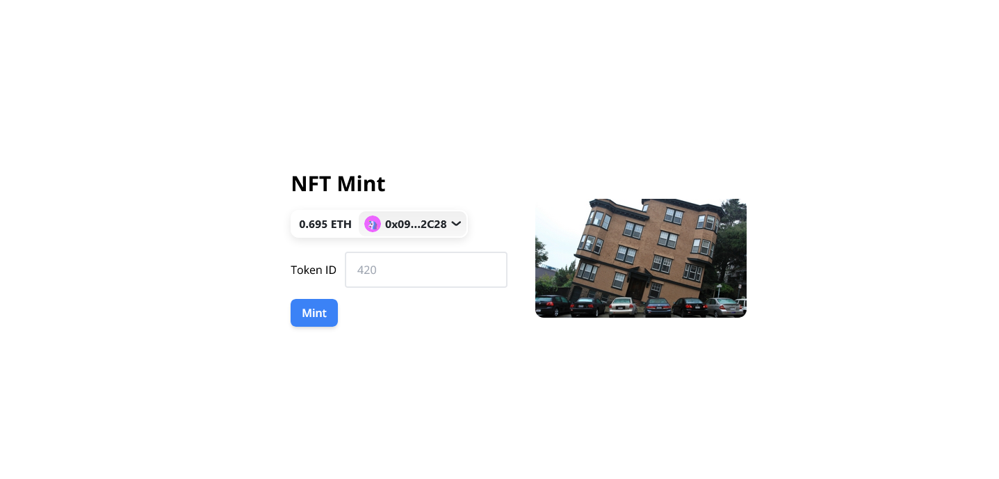

## Wallet Connect with Next.Js Rainbow kit, Wagmi, SIWE, Next-Auth, and Ethers.js

## System Requirements

    # Node.js 16.8 or later.
    # MacOS, Windows (including WSL), and Linux are supported.

## Prerequisites

    # Download the Node js and setup your environment

    # Check your node version
    $ node -v

    # Check package manager version
    $ yarn -v (or) npm -v

## Quick Start

    # Clone the application
    $ git clone https://github.com/kirankumargonti/wallet-connect-with-rainbowkit-siwe.git
    
    # Install dependencies
    $ yarn install (or) npm install

    # Serve on localhost:3000
    $ yarn run dev (or) npm run dev

**After cloning, modify the given .env.local file, and populate it with the following variables**
    
    NEXTAUTH_URL=http://localhost:3000
    NEXTAUTH_SECRET=somereallysecretsecret
    ALCHEMY_URL=lsdhfkbasvcajsfcakyjsgfcuyasgdcasvdchjad